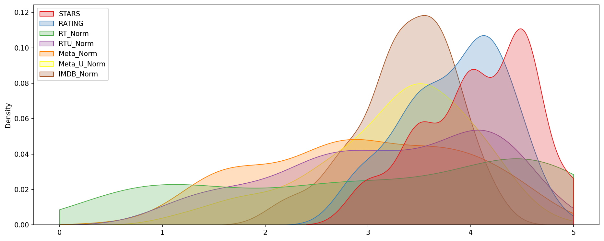

# Fandango Rating Analysis

Description: A data analysis project built to recreate the findings of a FiveThirtyEight investigation into Fandango's movie rating system. The original article raised concerns that Fandango was artificially inflating ratings. Built using Python, primarily Pandas and Seaborn.

Original Article: https://fivethirtyeight.com/features/fandango-movies-ratings/

About the dataset: Dataset obtained from [here](https://github.com/fivethirtyeight/data/tree/master/fandango). Contains Fandango's star ratings and displayed ratings, alongside aggregated scores scraped from Rotten Tomatoes, Metacritic, and IMDB.

The data was imported, cleaned, and analyzed in Python, with visualizations built to compare Fandango's ratings against other platforms. [Full process is outlined here.](https://github.com/adamsami-62/Fandango-Analysis/blob/main/FandangoDataAnalysisProject.ipynb)

**Example Code**
```python
# Normalizing all rating platforms to Fandango's 0-5 scale for comparison
df['RT_Norm'] = np.round(df['RottenTomatoes']/20,1)
df['RTU_Norm'] = np.round(df['RottenTomatoes_User']/20,1)
df['Meta_Norm'] = np.round(df['Metacritic']/20,1)
df['Meta_U_Norm'] = np.round(df['Metacritic_User']/2,1)
df['IMDB_Norm'] = np.round(df['IMDB']/2,1)
```

**Example Visualization**

